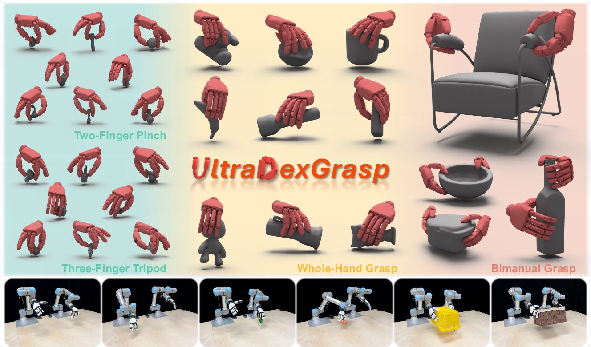

<br>
<p align="center">
  <h1 align="center"><strong>UltraDexGrasp: Learning Universal Dexterous Grasping for Bimanual Robots with Synthetic Data</strong></h1>
  <p align="center">
    Sizhe Yang, Yiman Xie, Zhixuan Liang, Yang Tian, Jia Zeng, Dahua Lin, Jiangmiao Pang
    <br>
    Shanghai AI Laboratory, The Chinese University of Hong Kong, Zhejiang University, The University of Hong Kong, Peking University
    <br>
  </p>

  <p align="center"><strong>ICRA 2026</strong></p>
</p>

<div id="top" align="center">

[](https://arxiv.org/abs/2603.05312)
[](https://yangsizhe.github.io/ultradexgrasp/)

</div>


## 📋 Contents

- [🔥 Highlight](#highlight)
- [🛠️ Getting Started](#getting_started)
- [🔗 Citation](#citation)
- [📄 License](#license)
- [👏 Acknowledgements](#acknowledgements)


## 🔥 Highlight <a name="highlight"></a>

**UltraDexGrasp** is a framework for universal dexterous grasping with bimanual robots.

The proposed data generation pipeline integrates an optimization-based grasp synthesizer with a planning-based demonstration generation module, and **supports multiple grasp strategies, including two-finger pinch, three-finger tripod, whole-hand grasp, and bimanual grasp**.

Trained on data produced by this pipeline, the policy demonstrates **robust zero-shot sim-to-real transfer and strong generalization to novel objects** with varied shapes, sizes, and weights.




## 🛠️ Getting Started <a name="getting_started"></a>

### Installation

First, clone this repository.

```
git clone https://github.com/InternRobotics/UltraDexGrasp.git
```

(Optional) Use conda to manage the python environment.

```
conda create -n ultradexgrasp python=3.10 -y
conda activate ultradexgrasp
```

Install dependencies.
```
# Install PyTorch according to your CUDA version. For example, if your CUDA version is 11.8:
pip install torch==2.4.1 torchvision==0.19.1 torchaudio==2.4.1 --index-url https://download.pytorch.org/whl/cu118

# Install other dependencies
pip install -r requirements.txt

mkdir third_party; cd third_party

# Install PyTorch3D. If you encounter any problems, please refer to the detailed installation instructions at https://github.com/facebookresearch/pytorch3d.
git clone https://github.com/facebookresearch/pytorch3d.git
cd pytorch3d
pip install -e . --no-build-isolation
cd ..

# Install cuRobo
sudo apt install git-lfs
git clone https://github.com/NVlabs/curobo.git
cd curobo
pip install -e . --no-build-isolation
cd ..

# Install BODex_api (adapted from https://github.com/JYChen18/BODex)
git clone https://github.com/yangsizhe/BODex_api.git
cd BODex_api
pip install -e . --no-build-isolation
pip install torch-scatter -f https://data.pyg.org/whl/torch-2.4.1+cu118.html  # for torch-2.4.1 and cuda-11.8
conda install coal -c conda-forge -y
conda install boost=1.84.0 -y
cd src/bodex/geom/cpp; python setup.py install
cd ../..

```


### Usage

Generate trajectories for various grasp strategies by running:

```
# left whole hand grasp
python rollout.py \
    --hand 0 \
    --object_scale_list '[0.08]'

# right whole hand grasp
python rollout.py \
    --hand 1 \
    --object_scale_list '[0.08]'

# bimanual grasp
python rollout.py \
    --hand 2 \
    --object_scale_list '[0.25]'

# left three-finger tripod
python rollout.py \
    --hand 3 \
    --object_scale_list '[0.04]'

# right three-finger tripod
python rollout.py \
    --hand 4 \
    --object_scale_list '[0.04]'

```

You can change the `object_mesh_path` in `env/config/env.yaml` to the mesh path of another object. For mesh processing, please refer to [BODex](https://github.com/JYChen18/BODex).


## 🔗 Citation <a name="citation"></a>

If you find our work helpful, please cite:

```bibtex
@article{yang2026ultradexgrasp,
  title={UltraDexGrasp: Learning Universal Dexterous Grasping for Bimanual Robots with Synthetic Data},
  author={Yang, Sizhe and Xie, Yiman and Liang, Zhixuan and Tian, Yang and Zeng, Jia and Lin, Dahua and Pang, Jiangmiao},
  journal={arXiv preprint arXiv:2603.05312},
  year={2026}
}
```


## 📄 License <a name="license"></a>

This repository is released under the [Apache 2.0 license](./LICENSE).


## 👏 Acknowledgements <a name="acknowledgements"></a>

Our code is built upon [BODex](https://github.com/JYChen18/BODex). We thank the authors for open-sourcing their code and for their significant contributions to the community.
